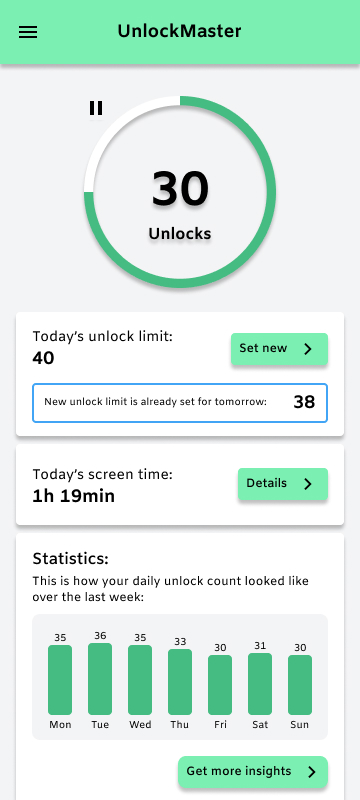
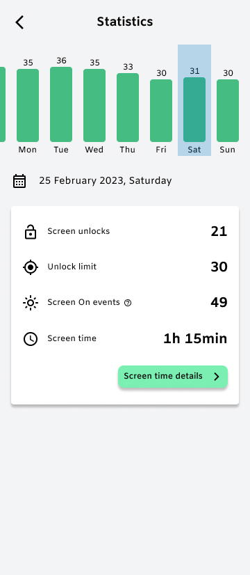
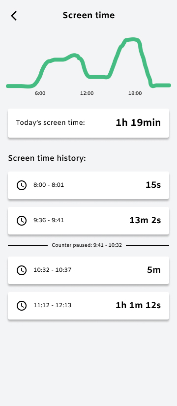
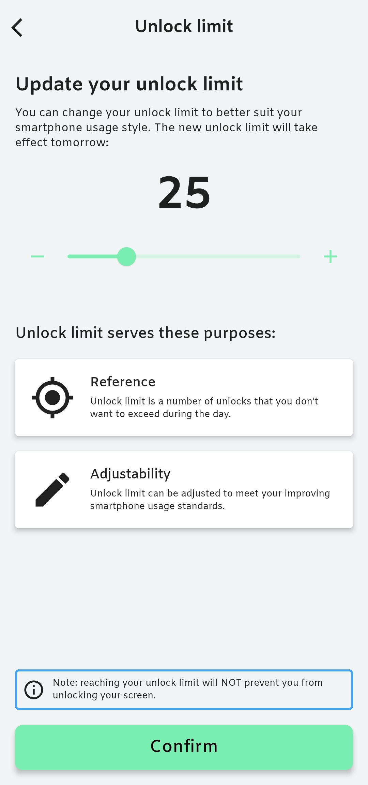

   

<h1 align="center"><b>UnlockMaster</b></h1>

### UnlockMaster: Unlock the Power of Mindful Smartphone Use

Are you tired of mindlessly unlocking your phone, only to find yourself lost in endless scrolling or compulsively checking your apps? Say hello to UnlockMaster, your ultimate companion for conscious smartphone usage.

**Unlock Your Potential**

UnlockMaster believes that every unlock can be a step towards a more mindful digital life. Our app empowers you to regain control over your screen time by tracking your unlocks and setting your own unlock limit.

**Stay Informed**

With real-time notifications, UnlockMaster keeps you in the loop. You'll receive updates on your unlock count in relation to your limit, serving as a friendly reminder to stay on track.

**Set Your Goals**

UnlockMaster is all about helping you achieve your smartphone usage goals. Receive motivational notifications as you're nearing your daily unlock limit, so you can make more conscious choices further in the day.

**Reflect and Refine**

At the end of each day, our app shows you a daily wrap-up notification. Tap it to discover insightful summaries, helpful suggestions for adjusting your unlock limit, and more.

**Visualize Your Progress**

UnlockMaster doesn't just track unlocks; it also provides you with eye-catching charts. Monitor your unlocks and screen time with beautiful charts, giving you a clear picture of your progress.

### Unlock the potential of mindful smartphone use with UnlockMaster.
### Take control of your digital life, *one unlock at a time*.

 

  
     
     
     
     

> Application is still in the development phase.